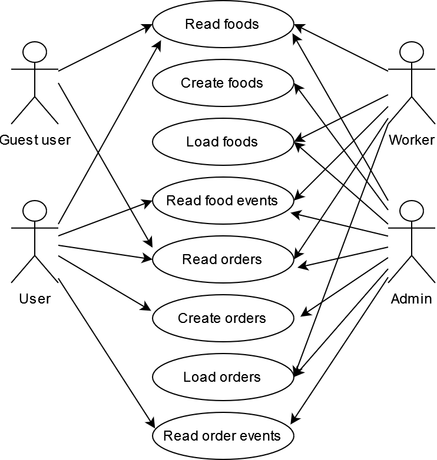
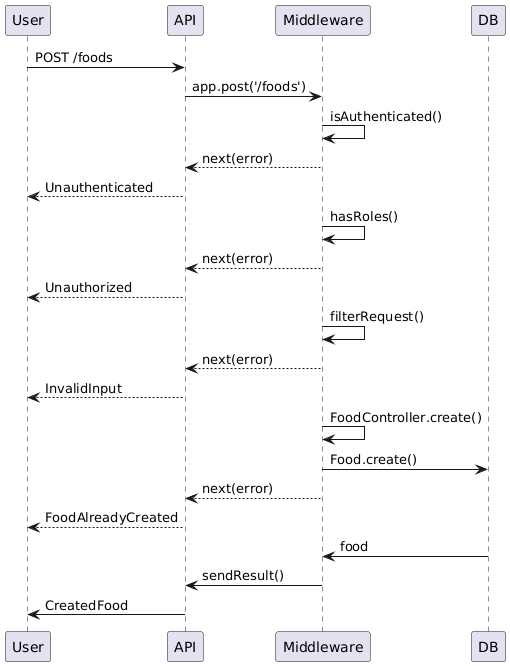
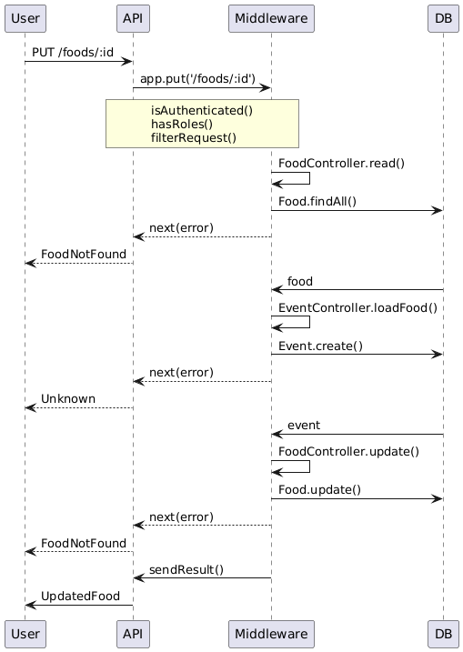
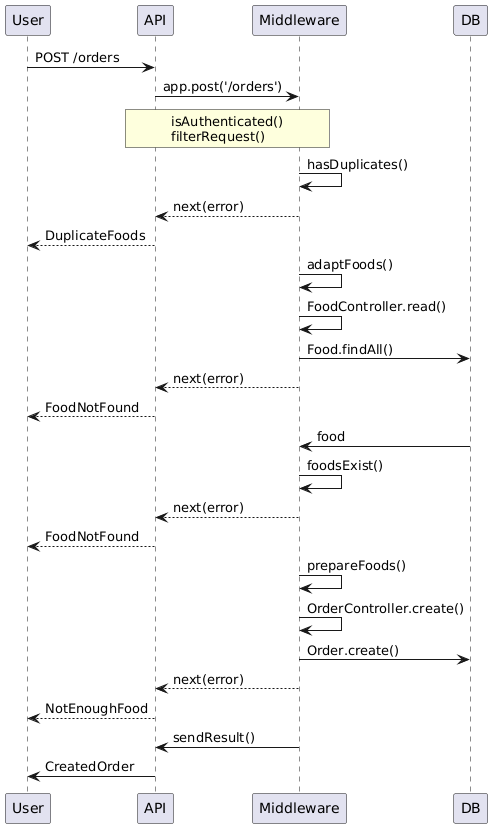
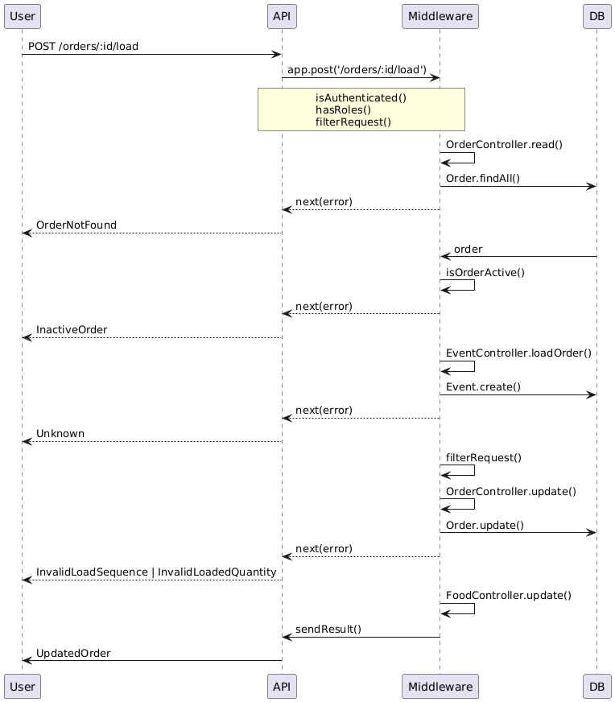

# animal-feeding-manager

**Progetto per il corso di Programmazione Avanzata A.A. 2023/2024**

## Project goals

The project aims to provide a system capable of managing a workflow relative to withdrawal of foods destined to an animal feeding system. 
An authenticated user can perform various actions, such as:
- Insert new foods (`worker`,`admin` roles).
- Update food quantities (`worker`,`admin`).
- Create orders with a list of foods and their amounts.
- Perform food loads relative to specific orders (`worker`/`admin`)
- Obtain information about foods and orders, like:
	- Order status and load events.
	- Differences between required and loaded food quantities.
	- Total time (in microseconds) used to perform all loads relative to a specific order.

This project has been made using [express](https://expressjs.com/) to manage routes and [sequelize](https://sequelize.org/) to handle database connection.

## Usage

- Ensure [docker](https://www.docker.com/), [docker-compose](https://docs.docker.com/compose/) and [node.js](https://nodejs.org/en) are installed.
- Clone this repository `git clone https://github.com/mattbn/animal-feeding-manager`.
- Ensure a `.env` file with every required key is inside the project folder (`.env.keys` in the project folder contains the list of the keys).
- Enter the following commands in a terminal inside the project directory:
	- `npm install --only=dev` to install the required dev dependencies.
	- `npx tsc` to compile the project.
	- `docker compose build` or `docker-compose build` to create the container images.
	- `docker compose up` or `docker-compose up` to start the containers.

## Design

### Routes
|Route                  |Role                           |Authentication (Y/N)?        |
|-----------------------|-------------------------------|-----------------------------|
|GET `/foods` 	        |-                              |N                            |
|POST `/foods`          |`admin`,`worker`               |Y                            |
|GET `/foods/:id`       |`user`,`admin`,`worker`        |Y                            |
|PUT `/foods/:id`       |`admin`,`worker`               |Y                            |
|GET `/foods/:id/events`|`user`,`admin`,`worker`        |Y                            |
|GET `/orders`          |-                              |N                            |
|POST `/orders`         |`user`,`admin`                 |Y                            |
|GET `/orders/:id`      |`user`,`admin`,`worker`        |Y                            |
|POST `/orders/:id/load`|`admin`,`worker`               |Y                            |
|GET `/orders/:id/info` |`user`,`admin`,`worker`        |Y                            |

### UML diagrams

#### Use case diagram

#### Sequence diagrams

##### POST /foods

##### PUT /foods/:id

##### POST /orders

##### POST /orders/:id/load

### Patterns

Various patterns were used in this project:

#### Model-Controller

The Controller pattern is a component of the MVC pattern (Model-View-Controller) which contains all business logic of the application. In this project, there are some controllers which handle CRUD operations on data.

The Model pattern is also a component of the MV* pattern (Model-View-Presenter, Model-View-ViewModel, ...) which represents the application data and it's often implemented as a DAO (Data Access Object) for persistence. In the project, every file in the `src/model` folder contains a model class, created by extending the Sequelize model class, which handles the underlying persistence logic.

#### Chain of responsibility

The Chain of responsibility pattern consists of an ordered collection of functions (*middlewares*) that usually serve as validation steps for some input data. In this project, the Chain of responsibility pattern has been implemented by passing arrays of middleware functions to Express' request handlers.

#### Singleton

The Singleton pattern is used to model objects which are meant to have only one instance running. It's useful to prevent the creation of more than one handle to some external resource, like a database connection.
In this project, the Singleton pattern has been used to represent the Handler classes.

#### Factory method

The Factory method pattern consists of a class (the *Factory*) containing a static method capable of returning newly created instances of some class (the *Product*) based on an input selector parameter.
In this project, the Factory method pattern has been used to generate Result objects, which contain the application outputs for the user.

#### Decorator

Decorator is a type of pattern which can be used to add extra functionality to some other type. In this project, the Decorator pattern is used to add HTTP status codes to responses based on the result types.

## Test

A [Postman]() collection is included in the repository to test the application once it's running.
You can run the tests by installing [newman]() and by entering: `npm run test` or `newman run --verbose animal-feeding-manager.postman_collection.json` in a terminal inside the project folder.
Ensure the collection's environment variables match the ones defined in the `.env` file to be able to connect to the service.
